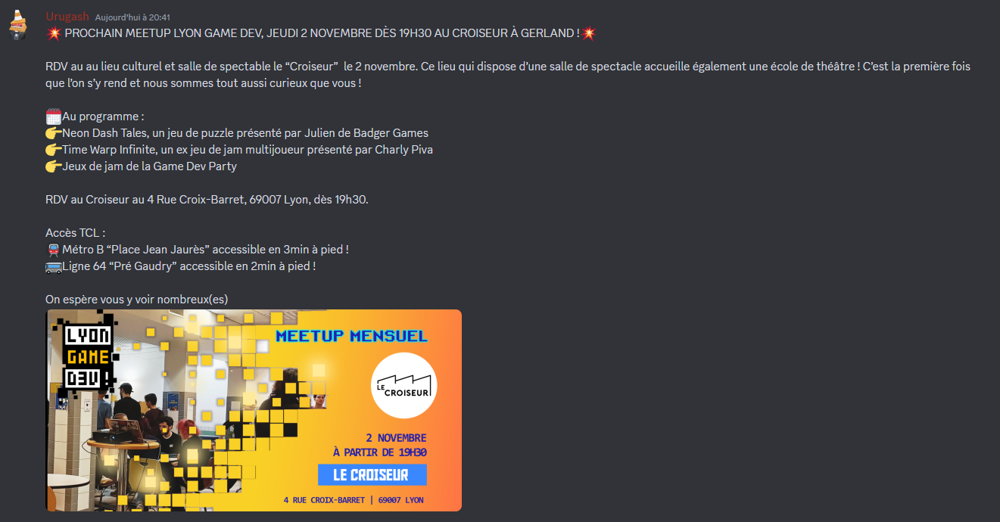
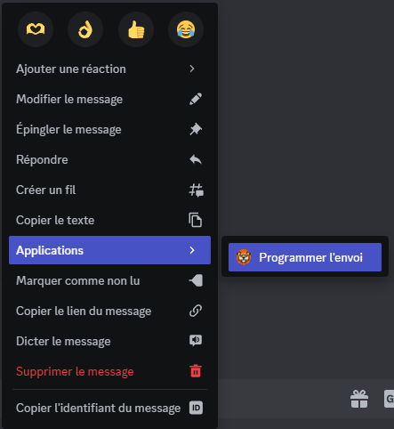
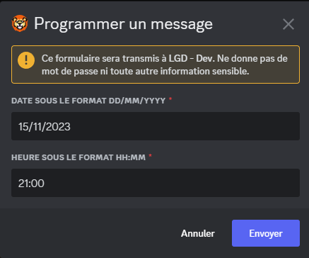

# Programmer un message

Cette commande n'est disponible que pour le pôle communication (et les membres du CA).

Elle permet d'écrire un message à l'avance dans un channel au choix puis de programmer l'envoi de ce message dans le channel #👑📢-annonces .

## Comment programmer un message

Il faudra en premier temps écrire votre message complet comme vous l'aviez prévu, mais dans un channel différent du serveur (par exemple le channel #🦁📣-pôle-com).

Ensuite, il vous suffit de faire un clic droit sur le message pour voir l'option pour Programmer l'envoi.

Un formulaire apparaît pour renseigner la date et l'heure d'envoi voulu.

Finalement le bot vous répond si le message est correctement planifié.

